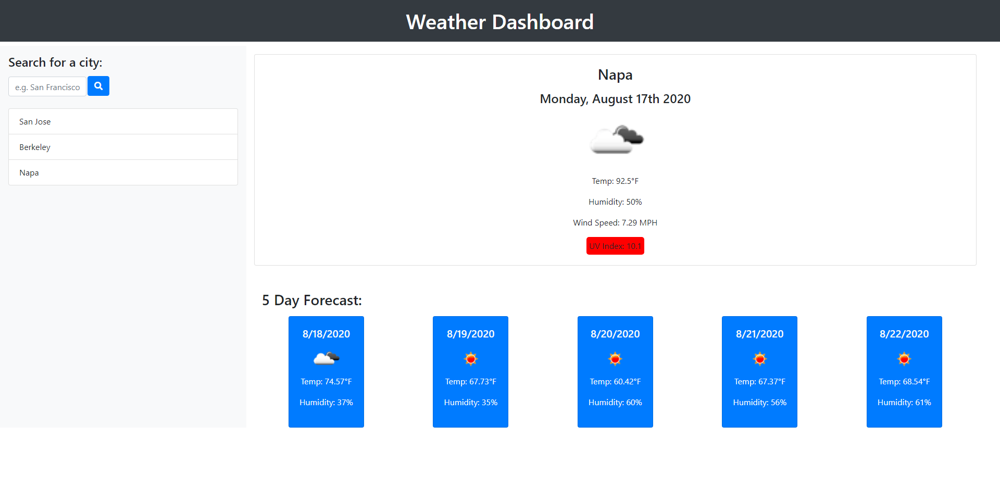

# Weather-Dashboard

## Introduction

My task for this assignment was to build a weather dashboard that will run in the browser and feature dynamically updated HTML and CSS. Using the OpenWeather API, I was able to retrieve weather data for specific cities. 

## Instructions

When the user searches for a city, they will be presented with the current weather conditions as well as a 5 day forecast for that city. The weather data will include the city name, the date, an icon representation of weather conditions, the temperature, the humidity, the wind speed, and the UV index. The UV index will be highlighted by a color code indicating the severity of the conditions. 

After a search, a search history list will populate with clickable city names. When the Weather Dashboard is opened, data from the last search will appear. If there are no searches in local storage, San Francisco will populate as the default city. 

## Technologies

* HTML
* CSS
* JavaScript
* JQuery
* Moment.js
* OpenWeather API

## Deployed

[GitHub Repo - https://github.com/bosshogg86/weather-dashboard](https://github.com/bosshogg86/weather-dashboard)

[Weather-Dashboard - https://bosshogg86.github.io/weather-dashboard/](https://bosshogg86.github.io/weather-dashboard/)

